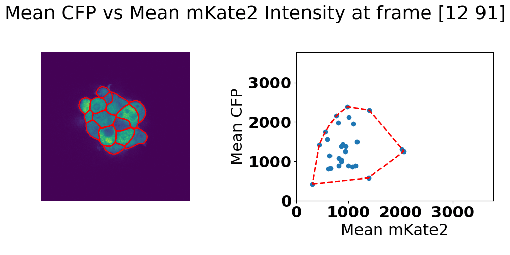
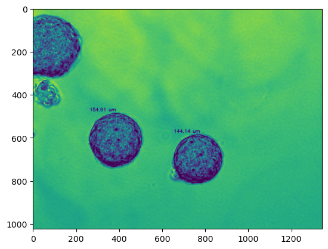

# spheroid-analysis

Pixel level

- `gif_plotting.ipynb`
  - Creates gifs with distributions
- `noise_analysis.ipynb`
  - tests different percentages of inner and outer in how they affect the noise
- `intrinsic_extrinsic.ipynb`
  - Intrinsic and extrinsic noise analysis

Cell level

- `cell_level_analysis.ipynb`
  - Looks at noise in cell level using cell segmentation algorithm

Experimental

- `concentration_diam.ipynb`
  - Looks at the relationship between cell suspension concentration and diameter to control size of spheroids
